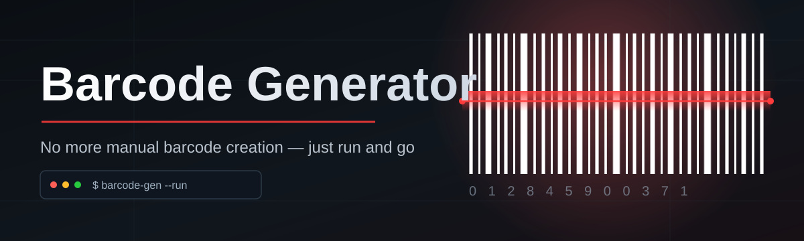
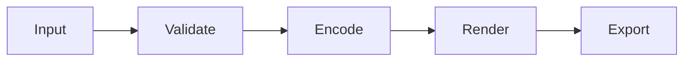

# barcode-generator-tool 📦🔖

  

*A native Windows barcode generator that turns raw data into print-ready symbology in seconds — no browser, no subscription, no nonsense.*

  

---

## 🙅 What This Is NOT

> [!NOTE]
> Before you scroll further — let's set expectations straight, because the barcode tooling space is full of half-baked web widgets pretending to be software.

**TL;DR: This is not a bloated SaaS wrapper, not a browser tab, and not a barcode generator that phones home.**

- ❌ It is **not** a web app that expires your export after 3 tries.
- ❌ It is **not** a Java-based relic from 2011 that needs a runtime you have to hunt down separately.
- ❌ It is **not** a "freemium" barcode generator that watermarks your Code128 unless you pay monthly.
- ❌ It is **not** dependent on an internet connection, a cloud account, or telemetry you didn't ask for.

**What it actually IS:** a lightweight, standalone Windows application that generates clean, scannable, standards-compliant barcodes — 1D and 2D — in batches or one at a time, with full control over size, format, and export quality. Built by one developer who got tired of fighting clunky enterprise barcode software just to print shelf labels.

---

## 🔍 Overview

**TL;DR: A focused, fast, offline-first barcode generator built for people who need barcodes *now*, not after a login flow.**

`barcode-generator-tool` exists because barcode generation shouldn't require a computer science degree or a monthly invoice. Whether you're labeling inventory in a small warehouse, generating QR codes for a menu, printing UPC/EAN codes for a retail product line, or batch-producing Code39 labels for asset tracking, this tool gets you from raw text/data to a crisp, print-ready barcode image without friction. It supports the symbologies people actually use in the real world — Code128, Code39, EAN-13, UPC-A, QR Code, Data Matrix, and PDF417 — and exports to formats that actually work in production pipelines: PNG, SVG, and PDF.

This project is a genuine passion project, not a corporate fork of some abandoned library. It was built from the ground up with a simple obsession: barcode generation should be *instant*, *accurate*, and *yours* — no cloud dependency, no recurring fee, no ad-supported "free tier" nonsense. Every rendering decision, from module width calculation to quiet-zone padding, was tuned by hand against real scanner hardware, not just eyeballed against a screenshot.

Who is this for? Small business owners who need shelf labels by Friday. Warehouse and logistics teams building custom asset-tracking workflows. Developers who want a quick desktop utility to batch-generate barcodes for a database migration. Hobbyists building a personal library catalog. If you've ever typed "generate barcode online" into a search bar and cringed at the ad-riddled result, this tool was built with you in mind.

---

## ⚔️ How It Stacks Up

**TL;DR: Faster, offline, and free of subscription traps compared to most alternatives on the market.**

| Capability | barcode-generator-tool | Typical Web Generators | Legacy Desktop Suites |
|---|---|---|---|
| Works fully offline | ✅ Yes | ❌ No | ✅ Yes |
| Batch generation | ✅ Built-in | ⚠️ Limited/paywalled | ✅ Yes (clunky UI) |
| No login / account | ✅ Never | ❌ Required for exports | ⚠️ License key required |
| Native Windows performance | ✅ Optimized | ❌ N/A (browser) | ⚠️ Often bloated |
| Vector export (SVG/PDF) | ✅ Yes | ⚠️ Sometimes | ✅ Yes |
| Modern UI / themes | ✅ Dark & Light | ⚠️ Varies wildly | ❌ Rarely updated |
| Price | 💚 Free & MIT | 💸 Freemium tiers | 💸 One-time or subscription |
| Startup time | ⚡ ~1 second | 🐌 Depends on connection | 🐢 Often 10+ seconds |

> [!TIP]
> If you've been generating barcodes by pasting text into a sketchy online form and screenshotting the result — this table is your permission slip to stop.

---

## 🎯 What It Actually Does

**TL;DR: Point it at your data, pick a symbology, and get a pixel-perfect barcode in one click.**

- **Multi-symbology rendering** — supports Code128, Code39, EAN-13, EAN-8, UPC-A, QR Code, Data Matrix, and PDF417, each rendered with symbology-correct checksums and quiet zones so scanners don't choke.

- **Batch processing engine** — feed it a CSV or line-delimited list and it churns out hundreds of barcodes in one pass, named and organized automatically.

- **Vector-first export** — every barcode can be exported as SVG or embedded into a PDF, meaning your labels stay crisp no matter how much you scale them for large-format printing.

- **Live preview canvas** — see your barcode render in real time as you type, with instant feedback on scan-readability (module width, contrast, aspect ratio).

- **Custom label composer** — attach human-readable text, logos, and captions alongside the barcode itself, so your printed labels look professional out of the box.

- **Template memory** — save your favorite size/format/margin combos as reusable presets, so repeat jobs take seconds instead of re-configuration.

- **Print-calibration mode** — a built-in test-print grid helps you verify your printer's DPI output actually matches real-world barcode module dimensions before you commit to a full batch.

- **Zero telemetry** — no analytics pings, no "phone home" behavior, no hidden network calls. What happens on your machine stays on your machine.

---

## 🚀 Getting Started

**TL;DR: Visit the landing page, download, run the executable, start generating.**

1. **Visit the landing page** using the download button above or below — it's the only official distribution point for this tool.

2. **Download the installer** for your Windows machine (10 or 11, both fully supported).

3. **Run the executable** — no setup wizard maze, no bundled toolbar offers, no "custom install" traps. Just a clean launch.

4. **Generate your first barcode** — type or paste your data, pick a symbology from the dropdown, and hit Export. That's it.

> [!IMPORTANT]
> Always download from the official landing page linked in this README. Third-party mirrors are not sanctioned and may not reflect the current, tested build.

---

## 🖥️ System Requirements

**TL;DR: Any modern Windows PC. No extra runtimes, no dependency hell.**

| Requirement | Minimum |
|---|---|
| OS | Windows 10 (64-bit) or Windows 11 |
| RAM | 4 GB |
| Disk space | ~150 MB |
| Dependencies | None — fully standalone |
| Internet connection | Not required after download |
| .NET / Runtime installs | Not needed — self-contained build |

  

---

## 🧠 How It Works

**TL;DR: Input → symbology engine → render → export. Simple pipeline, no magic tricks.**

Under the hood, the tool follows a deliberately simple pipeline so that behavior stays predictable and debuggable:

1. **Input capture** — your text, number sequence, or CSV batch is parsed and validated against the rules of the chosen symbology (e.g. EAN-13 requires exactly 12 digits before checksum calculation).

2. **Checksum & encoding** — the engine computes the correct checksum digit and encodes the data into the module pattern defined by that barcode standard.

3. **Vector rendering** — the encoded pattern is drawn onto a vector canvas, respecting quiet-zone padding and minimum module width for scanner reliability.

4. **Preview & adjust** — you see the live result instantly and can tweak size, color, and label text before finalizing.

5. **Export** — the final barcode is written out as PNG, SVG, or embedded directly into a PDF label sheet.

---

## 🩹 Troubleshooting

**TL;DR: Most issues come down to scanner distance, print DPI, or data format mismatches — here's the fix for each.**

<strong>My barcode won't scan even though it looks fine on screen</strong>

Check your printer DPI. Barcodes need a minimum module width (usually ~0.010") to stay scannable — low-DPI printing can shrink bars below that threshold. Use the built-in print-calibration grid to verify before a full batch run.

<strong>EAN-13 / UPC-A rejects my input</strong>

These symbologies require an exact digit count before the checksum is appended. EAN-13 needs 12 digits, UPC-A needs 11. If you're pasting a barcode that already includes a checksum digit, drop the last digit and let the tool recalculate it.

<strong>QR codes generate but my phone camera won't read them</strong>

Increase the "quiet zone" margin around the QR module in settings — cramped QR codes with no white-space border often fail on lower-end phone cameras with tighter focus tolerance.

<strong>Batch export is skipping some rows</strong>

Check for empty lines or malformed entries in your CSV — the batch engine skips invalid rows silently by default. Enable "Verbose Batch Log" in Settings to see exactly which rows were skipped and why.

<strong>The app won't launch after download</strong>

Windows SmartScreen sometimes flags new, less-common executables on first run. Click "More info" → "Run anyway." This is standard behavior for independently distributed software that hasn't yet built up download volume with Microsoft's reputation system.

> [!WARNING]
> Never disable your antivirus entirely to run any downloaded executable — including this one. If SmartScreen flags something beyond the standard first-run notice, stop and verify you downloaded from the official landing page.

---

## 🎨 UI / UX Details

**TL;DR: Dark mode by default, keyboard-driven workflow, and settings that remember what you like.**

- **Themes** — Dark (default) and Light, toggle with `Ctrl+Shift+T`.

- **Keyboard shortcuts**:

  | Action | Shortcut |
  |---|---|
  | New barcode | `Ctrl+N` |
  | Export current |